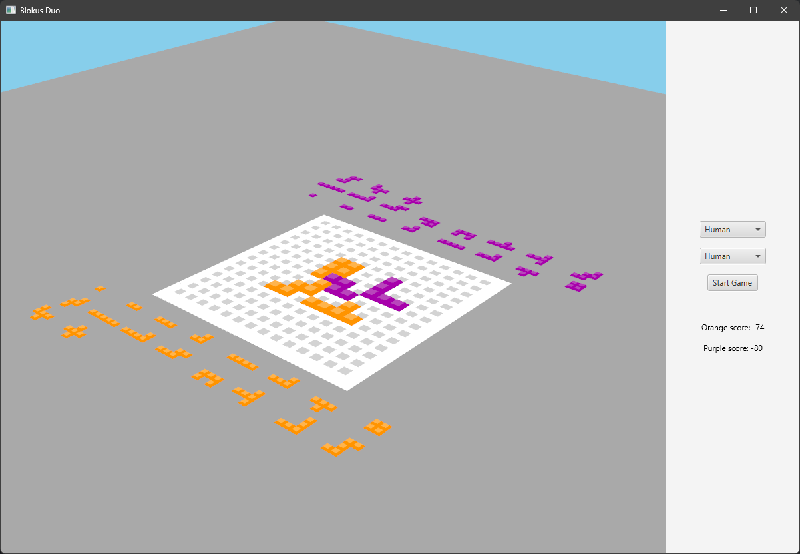

Bernard Alban \
Burdairon Florian

# Blokus Duo



## Description

This project is a Blokus Duo game (2 players) that follows the same rules as the board game of the same name. The objective is to place more pieces than your opponent. The project was developed as part of a course at Polytech Lyon in the 4th year of Computer Science in the AI course. Therefore, different algorithms (Minimax, Alpha-Beta, MCTS) have been integrated to allow playing against the computer. The game uses the JavaFX library to manage the 3D display of the game board.

## Features

- Two-player mode
- Play against the computer with different AI algorithms (Minimax, Alpha-Beta, MCTS)
- 3D game board display using JavaFX

## Requirements

- Java 21
- Maven

## Installation

1. Clone the repository:
    ```sh
    git clone https://github.com/florianBurdairon/tp_ia_blokus_duo.git
    cd blokus-duo
    ```

2. Build the project using Maven:
    ```sh
    mvn clean install
    ```

## Usage

1. Run the application:
    ```sh
    mvn javafx:run
    ```

2. The game will start, and you can choose to play against another player or the computer.

## Project Structure

- `src/main/java/blokus` - Main application code
- `src/main/java/blokus/render` - Rendering logic for the game board
- `src/main/java/blokus/logic` - Game logic and rules
- `src/main/java/blokus/player` - Player-related classes and AI algorithms
- `src/main/java/blokus/utils` - Utility classes
- `src/main/java/blokus/ai_logic` - logic for MCTS

## License

This project is licensed under the MIT License.